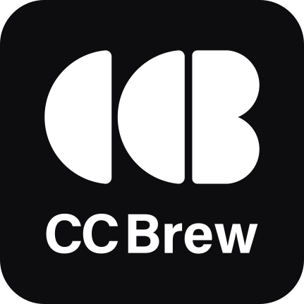

<p align="center">
  
</p>

# CC Brew — De idea a herramienta que convence a tu cliente

CC Brew estructura tu idea, define qué debe convencer a tu cliente y genera un `CLAUDE.md` listo para construir con Claude Code.

```
ccbrew.kitifica.com (PWA)  ──── Supabase  �───  Claude Code
  Idea libre                                    CLAUDE.md
  Cuestionario          ──────►                 6 criterios
  Semáforo IA           ◄──────                 Validación
```

**Gratis con Claude Code · App Directa desde $4 · Sin vencimiento**

---

## Cómo funciona

1. **Escribí tu idea** — sin estructura, sin límites. Contale a la IA qué querés lograr.
2. **Respondé unas preguntas** — opción múltiple, menos de un minuto. Cubre recorrido del cliente, alcance v1, restricciones y reacción esperada.
3. **CLAUDE.md listo** — documento con Fase 1 (qué construir ahora) y Fase 2 (visión futura, bloqueada). Copialo o compartilo directo.

---

## 6 criterios de validación

| Criterio | ¿Qué mide? | Bloquea? |
|---|---|---|
| Claridad de la objeción | ¿Qué duda o resistencia del cliente hay que resolver? | Sí |
| Alcance v1 | ¿Qué entra y qué queda fuera de la primera versión? | Sí |
| Recorrido del cliente | ¿Cómo ve y usa la herramienta el cliente, paso a paso? | No |
| Dependencias externas | ¿Hay integraciones complejas sin resolver? | No |
| Coherencia | ¿Las respuestas son consistentes entre sí? | No |
| Viabilidad | ¿Tamaño realista para una primera pieza? | No |

---

## Dos formas de usar

### App Directa (PWA)
Desde tu celular o laptop, donde estés. Instalada como app nativa. Sin Claude Code requerido.

- [ccbrew.kitifica.com](https://ccbrew.kitifica.com)
- iOS, Android, Windows, macOS
- Créditos por proyecto, sin vencimiento
- Primeros 3 proyectos gratis

### Gratis con Claude Code

Desde tu equipo con Claude Code. Un comando para conectar el MCP, un archivo para el Skill. Procesamiento en tu equipo, cero créditos.

- Gratis con tu suscripción de Claude
- Requiere Claude Code CLI instalado
- Usa `/cc-brew` directo en el chat
- Solo funciona desde tu equipo de escritorio

#### MCP

Pegá este prompt en Claude Code. Reemplazá `TU_API_KEY` con tu clave — la encontrás en [ccbrew.kitifica.com](https://ccbrew.kitifica.com) → Ajustes → API Key.

```bash
# Instalar el MCP de CC Brew. Reemplaza TU_API_KEY con tu clave
# (la encontrás en ccbrew.kitifica.com → Ajustes → API Key) y ejecuta:

claude mcp add cc-brew --transport http "https://cc-brew-mcp.netlify.app/mcp" \
  --header "Authorization: Bearer TU_API_KEY" --scope user
```

#### Skill

[Descargar SKILL.md](https://ccbrew.kitifica.com/skill/SKILL.md)

Arrastrá el archivo al chat de Claude Code y pegá este prompt:

```
Instala este archivo como una Skill de Claude Code:
1. Muévelo a ~/.claude/skills/cc-brew/SKILL.md
2. Agrega esta entrada en ~/.claude/CLAUDE.md:

# cc-brew
- **cc-brew** (`~/.claude/skills/cc-brew/SKILL.md`) - estructura ideas de producto antes de construirlas con Claude Code
  Trigger: `/cc-brew`
```

---

## Precios

| Plan | Precio | Proyectos | Por proyecto |
|---|---|---|---|
| Inicio | $4 | 5 | $0.80 |
| Creador | $9 | 12 | $0.75 |
| Estudio | $12 | 20 | $0.60 |
| Trae tu API | $29 (pago único) | Ilimitados | — |

Créditos sin vencimiento. Primeros 3 proyectos gratis con cada cuenta nueva.

---

## Arquitectura

```
web/app/
├── page.js                    # PWA principal
└── components/
    ├── AuthGate.js            # Autenticación
    ├── IdeaCapture.js         # Campo de idea libre
    ├── ContextCapture.js      # Público objetivo + marca
    ├── Questionnaire.js       # Cuestionario de opción múltiple
    ├── SemaforoView.js        # 6 criterios de validación
    ├── DocumentViewer.js      # Visualización del CLAUDE.md
    ├── BuyMinutes.js          # Compra de créditos
    └── OnboardingTour.js      # Tour de inducción

mcp/
├── netlify/functions/
│   ├── ai-process.mjs        # Procesamiento con Claude
│   └── sessions.mjs          # Gestión de sesiones
└── lib/
    ├── tools.js              # Herramientas MCP
    └── sessions.js           # Sesiones y créditos
```

| Componente | Tecnología | Rol |
|---|---|---|
| PWA | Next.js + Netlify | Interfaz de captura y validación |
| MCP Server | Netlify Functions | Procesamiento con Claude Code |
| Backend | Supabase | Auth, datos, storage, pagos |
| Pagos | Wompi | Créditos y proyectos |

---

## Desarrollo local

```bash
# PWA
cd web && npm install && npm run dev

# MCP Server
cd mcp && npm install && npm run dev
```

---

## Stack recomendado para proyectos generados

CC Brew recomienda (no impone) según lo que el proyecto necesite:

- **Backend:** Supabase, Firebase, Neon, PlanetScale o Convex
- **Deploy:** Netlify, Vercel, Cloudflare Pages, Railway o Render
- **Repo:** GitHub, GitLab o Bitbucket
- **SEO:** Meta tags, sitemap, llms.txt, datos estructurados

---

## Seguridad

| Medida | Detalle |
|---|---|
| **Canal privado** | Supabase RLS sobre cada cuenta |
| **Créditos protegidos** | RPC server-side, saldo verificado antes de procesar |
| **API key encriptada** | Almacenada con Supabase Vault |
| **Open source** | Todo el código está en GitHub |

---

## Licencia

## Repositorio

[github.com/kitifica-max/cc-brew](https://github.com/kitifica-max/cc-brew)

---

## Licencia

[MIT](LICENSE)
