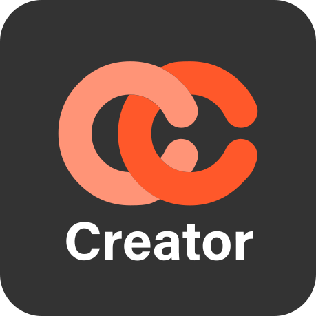

<p align="center">
  
</p>

# CC Controller — Remote Claude Code Bridge

Controla Claude Code desde tu iPhone usando una PWA como control remoto. El Mac ejecuta Claude Code localmente; el teléfono envía y recibe mensajes en tiempo real vía Supabase Realtime.

```
iPhone (PWA)  ──── Supabase Realtime ────  Mac (Electron tray)
  Escribe prompt                              claude CLI
  Ve streaming token a token   ◄──────       Transmite output
  Sube archivos                ──────►       Guarda en ~/CCProjects/
```

**Sin cuenta Supabase. Sin SSH. Sin túneles. Sin config de red.**

---

## Requisitos

- **Mac** con macOS 12+ (Apple Silicon o Intel)
- **Claude Code CLI** instalado: `npm install -g @anthropic-ai/claude-code`
- Suscripción activa a Claude (Max o Pro — requerida por el CLI)
- iPhone o cualquier móvil con navegador moderno

---

## Instalación en 3 pasos

### 1 — Descargar el DMG

Desde [GitHub Releases](https://github.com/kitifica-max/cc-controller/releases/latest):

| Chip | Archivo |
|---|---|
| Apple Silicon (M1/M2/M3/M4) | `CC.Controller-*-arm64.dmg` |
| Intel | `CC.Controller-*.dmg` |

> **DMG sin firmar:** macOS bloqueará la apertura por defecto. Clic derecho → *Abrir* → confirmar. Esto es un paso único. Ver sección [Seguridad](#seguridad) para más detalle.

Arrastra CC Controller a Applications. Al abrir, aparece en el tray (barra superior) sin ícono en el Dock.

### 2 — Setup inicial

La primera vez que CC Controller corre, abre una ventana de configuración automáticamente. El asistente:

1. Genera un `SESSION_ID` único para tu instalación
2. Genera un `SESSION_TOKEN` aleatorio (mín. 32 chars)
3. Muestra el **código de emparejamiento** (`sessionId:token`)
4. Guarda la config en `~/.config/cc-controller/.env`

Copia el código de emparejamiento — lo necesitas en el paso 3.

### 3 — Emparejar con la PWA

1. Abre [ccc.kitifica.com](https://ccc.kitifica.com) en tu iPhone
2. Agrega a la pantalla de inicio (Share → Add to Home Screen) para usarla como app nativa
3. Pega el código de emparejamiento cuando la PWA lo solicite
4. En CC Controller (tray) → clic derecho → **Iniciar**

Listo. Escribe desde el iPhone, Claude Code responde con streaming token a token.

---

## Uso Diario

### Flujo normal

1. CC Controller debe estar corriendo en el tray (barra superior del Mac)
2. Clic derecho → **Iniciar** para iniciar la sesión
3. Abre la PWA en el iPhone → chat activo

### Proyectos

- Toca el nombre del proyecto en el header de la PWA → lista de proyectos
- **Nuevo proyecto:** CC Controller crea `~/CCProjects/<slug>/` en el Mac
- **Abrir en Claude Code:** botón en el header → abre Terminal con `cd <proyecto> && claude`
- Claude Code siempre corre dentro del directorio del proyecto activo

### Subir archivos desde iPhone

Toca el ícono de clip en la barra de entrada. El archivo viaja a Supabase Storage temporalmente, Electron lo descarga al directorio del proyecto y lo elimina de Storage inmediatamente.

Formatos permitidos: `.png .jpg .jpeg .gif .pdf .txt .md .json .csv .svg .zip` (máx. 10 MB)

### Variables de entorno

Settings (⚙️) → Entorno. Las claves se guardan exclusivamente en:

```
~/CCProjects/<proyecto>/.env
```

con permisos `600`. Nunca se almacenan en la PWA ni en Supabase.

---

## Seguridad

El DMG no está notarizado (el certificado de Apple cuesta $99/año). Lo que sí existe es código completamente abierto: puedes leer `desktop/src/main.js`, `bridge.js` y `pty.js` antes de ejecutar.

| Medida | Detalle |
|---|---|
| **Código de emparejamiento** | `SESSION_ID` único por instalación + `SESSION_TOKEN` ≥ 32 chars. Sin ese par exacto, cualquier evento llega y se descarta en silencio. |
| **Sin puertos abiertos** | El Mac no escucha en ningún puerto. Todo viaja por Supabase WebSocket (WSS/TLS). Sin SSH, sin ngrok, sin IP expuesta. |
| **Path traversal bloqueado** | Toda ruta de archivo se valida dentro de `~/CCProjects/`. Paths con `../` o rutas absolutas externas rechazadas. |
| **Whitelist de archivos** | Solo extensiones permitidas, máx. 10 MB. Archivo eliminado de Supabase Storage inmediatamente tras descargarse. |
| **Secretos con permisos 600** | `.env` de cada proyecto escrito con `mode 0o600` — solo el usuario del sistema puede leerlo. |
| **Hardened Runtime** | `hardenedRuntime: true` en el build de Electron. |
| **Open source** | Todo el código está en GitHub. Sin binarios opacos ni dependencias sin fuente. |

> Si pierdes el iPhone: cambia `SESSION_TOKEN` en `~/.config/cc-controller/.env` y reinicia CC Controller. El dispositivo anterior no puede reconectar.

---

## Arquitectura

```
desktop/src/
├── main.js          # Entry point — tray, setup, event wiring, powerSaveBlocker
├── bridge.js        # Supabase Realtime bridge (broadcast + storage)
├── pty.js           # Claude CLI runner (child_process + streaming)
├── projects.js      # ProjectManager (~/.config + ~/CCProjects)
└── setup-window.js  # Wizard de primer setup

web/app/
├── page.js                    # Chat UI principal con streaming
└── components/
    ├── AuthGate.js            # Emparejamiento de código
    ├── SettingsSheet.js       # Modelo, effort, secretos, proyectos
    ├── ProjectsList.js        # Lista y gestión de proyectos
    └── FileUpload.js          # Subida de archivos
```

| Componente | Tecnología | Rol |
|---|---|---|
| Desktop | Electron 30 + Node.js | Ejecuta `claude` CLI, gestiona proyectos |
| PWA | Next.js 14 + Netlify | Control remoto desde el móvil |
| Bridge | Supabase Realtime (Broadcast) | Canal WebSocket cifrado entre ambos |
| Storage | Supabase Storage (`uploads`) | Tránsito temporal de archivos |

Supabase está **bundled** — los devs no necesitan cuenta propia.

---

## Desarrollo Local

```bash
# Desktop
cd desktop && npm install && npm run dev

# PWA
cd web && npm install && npm run dev
```

### Construir DMG

```bash
cd desktop
# Apple Silicon
npm run build -- --mac --arm64

# Intel (separado para evitar conflicto de volúmenes hdiutil)
npm run build -- --mac --x64
```

Los DMGs quedan en `desktop/dist/`.

---

## Solución de Problemas

**"Desktop detenido" en la PWA aunque Electron corra**
→ Electron envía heartbeat cada 20s. Si la PWA no recibe uno en 45s, marca el desktop como detenido. Verifica: clic derecho en tray → Iniciar.

**"no se puede abrir porque proviene de un desarrollador no identificado"**
→ Clic derecho → Abrir → confirmar. Solo ocurre la primera vez.

**La PWA pide código de emparejamiento otra vez**
→ El localStorage del navegador fue borrado. Abre CC Controller → clic derecho → Copiar código de emparejamiento (o revisa `~/.config/cc-controller/.env`).

**La respuesta de Claude tiene caracteres extraños (`[0m`, `[31m`)**
→ Caracteres ANSI. El bridge los filtra automáticamente. Si persisten, actualiza al DMG más reciente.

**La subida de archivos falla**
→ Verifica que la extensión del archivo esté en la whitelist y que el archivo sea menor a 10 MB.

**El Mac se duerme y la sesión se cae**
→ CC Controller activa `prevent-display-sleep` automáticamente mientras la sesión corre. Si el Mac igual se duerme, revisa System Settings → Battery → Prevent automatic sleeping.

---

## Licencia

[MIT](LICENSE)
